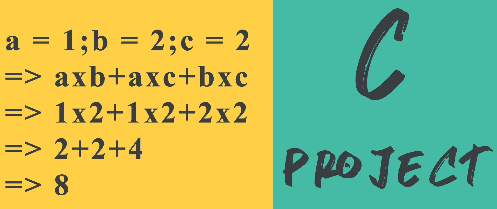

# Evaluation-of-mathematical-Expression-program-in-C-language-
This repository contains a c project which can evaluate mathematical expression. And project description is also added that how this project works.
It looks like this.

Video documentation: https://www.youtube.com/watch?v=XHXlwqpjwfY
